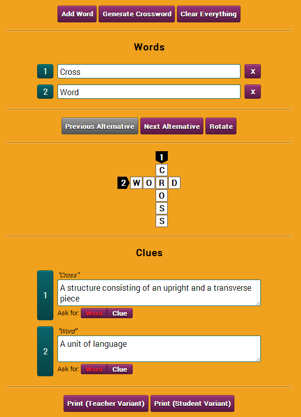

Crosswords
==========

A crossword generator for teachers. See it in action [here](https://johennes.github.io/Crosswords/).

### About

Crosswords is a browser-based application that lets you generate sparse
crossword puzzles out of a given set of words. Sparse means that the
puzzle will not be arranged to completely fill a rectangular region
(this would correspond to a dense crossword puzzle).

Some of the most important features include:

* Words and hints can be specified independently
* You can cycle through all possible crossword variants that can be
generated from a given set of words
* Crosswords can be rotated
* Crosswords can be printed in a teacher variant (includes words and
hints) as well as a student variant (includes blanks for words or hints)

### Running

Simply load `index.html` locally in your browser. No internet connection
required.

### Screenshots

## License

Crosswords is licensed under the GNU Affero General Public License as published
by the Free Software Foundation, either version 3 of the License, or (at your option) 
any later version.

The HTML5 shiv is licensed under the MIT/GPL2 license.

jQuery and jQuery UI are licensed under the MIT license.
